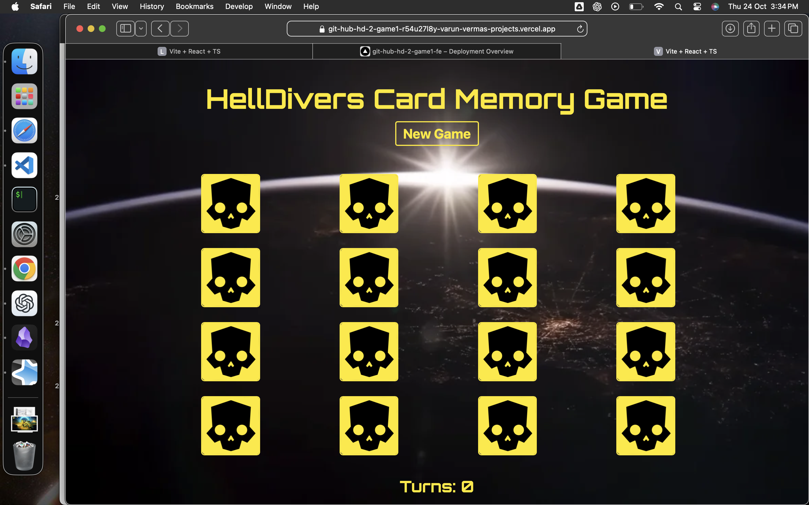
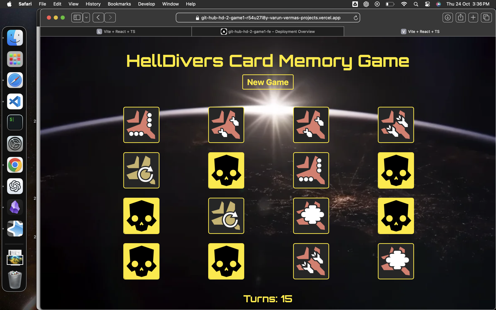

# Simple React Game : Memory Cards 
---
Wanted to make a simple project to explore the Deno 2.0 runtime so decieded to make this simple game.
Yes I'm a Helldivers fan, so I made it helldiver themed.

For first deployment, just have the Eagle Stratagrms, will add the remaining cards later.

### Stack used
- Deno 2.0 runtime 
- React (Vite bundler)
- TypeScript
- Vanilla CSS

### Deployment
- [Vercel Deployment Link](https://git-hub-hd-2-game1-r54u27l8y-varun-vermas-projects.vercel.app)

### Images

